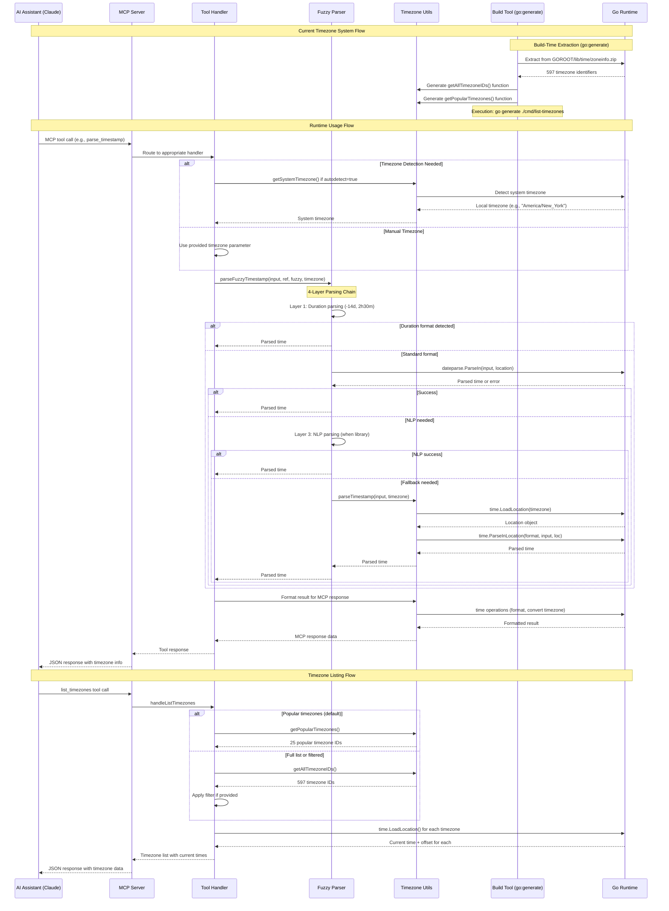

# Timezone System Architecture - Sequence Diagram

## How Timezone Automation Works in Passage of Time MCP Server

## Key Components Explained

### Build-Time Generation (go:generate Integration)
- **Tool**: `cmd/generate-timezone-list/main.go`
- **Source**: Go's embedded `zoneinfo.zip` 
- **Output**: Functions in `cmd/list-timezones/timezones.go`
- **Status**: ✅ Complete go:generate implementation
- **Command**: `go generate ./cmd/list-timezones`

### Runtime Integration
- **Entry Point**: MCP tool handlers in `server.go`
- **Parsing**: 4-layer fuzzy parsing chain
- **Timezone Resolution**: Cross-platform system detection
- **Output**: Formatted JSON responses

### Architecture Benefits
- **Build-time Validation**: Catches timezone data mismatches before deployment
- **Platform Independence**: Generation process works across Windows/Unix
- **Future-proof**: Automatically adapts to Go version timezone updates
- **No Circular Imports**: Standalone function generation avoids package dependencies

## Implementation Status

| Component | Status | Details |
|-----------|--------|---------|
| Extraction Tool | ✅ Complete | Works (597 timezones) |
| go:generate Integration | ✅ Complete | `//go:generate go run ../generate-timezone-list -output timezones.go` |
| Runtime Functions | ✅ Working | All tests passing |
| Cross-platform Support | ✅ Complete | Windows/Unix timezone detection |
| Generated Code | ✅ Gitignored | `cmd/list-timezones/timezones.go` excluded from version control |

*Last Updated: 2025-08-17 10:29 EST*